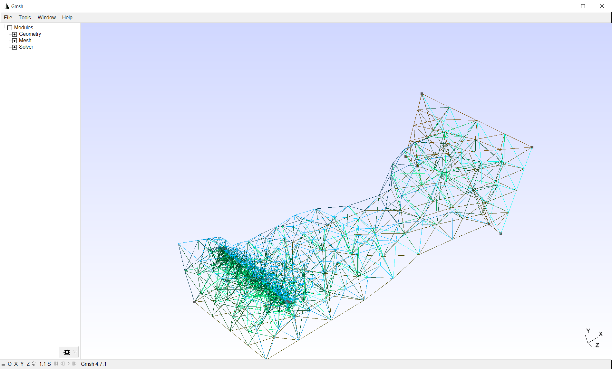

### Лаба 1: Gmsh

#### Что касается этапа 0

В файле `task0.cpp` лежит код, который рисует цилиндр и строит в нём сетку (при желании можно поверить, что перед этим был успешно нарисован и круг и квадрат).

#### Что касается этапа 1

В файле `task1.cpp` лежит код, рисующий полый тор (с ненулевой толщиной стенок, которые, следует признать, довольно толстые, но при желании моментально меняются параметрами вверху программы). Торы немного неидеальны ввиду выбранного способа параметризации. Если добавить ещё две "опорные" окружности, то будет лучше, но я надеюсь, что по коду в целом видно, что это можно сделать без ужасной боли (и не сделано лишь для экономии времени).

#### Что касается этапа 2

В файле `task2.cpp` лежит код, который мешит алеута (это такие индейцы с крутыми треугольными шапками, которые живут на алеутских островах).
